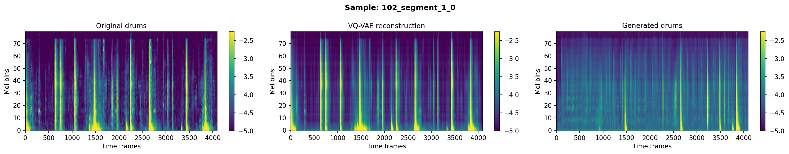
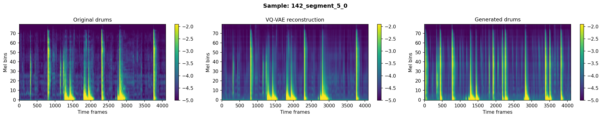

# JukeDrummer: Automatic Drum Accompaniment for Korean Pansori

Automatic generation of traditional Korean drum (*buk*) accompaniment patterns (*jangdan*) for pansori vocal performances, using VQ-VAE tokenization and autoregressive Transformer modeling.

Given a pansori vocal recording, JukeDrummer generates culturally appropriate drum patterns that follow the rhythmic structure (*jangdan*) of the performance.

## Architecture

```
Pansori Vocal Audio
        |
        v
  +-----------+       +----------------+
  | Mel Spec  |------>| Others VQ-VAE  |----> Others Tokens (condition)
  | Extractor |       +----------------+
  +-----------+
        |
        v
  +-----------+
  | Beat/Phase|----> Downbeat Phase (dphase) Conditioning
  | Extractor |      (sawtooth 0->1 between downbeats)
  +-----------+

  Others Tokens + dphase
        |
        v
  +---------------------+
  | Transformer LM      |----> Predicted Drum Tokens
  | (Encoder-Decoder)   |
  +---------------------+
        |
        v
  +-----------+       +----------+
  | Target    |------>| HiFi-GAN |----> Generated Drum Audio
  | VQ-VAE    |       | Vocoder  |
  | (Decode)  |       +----------+
  +-----------+
```

**Key components:**
- **VQ-VAE**: Encodes mel spectrograms into discrete tokens. Separate codebooks for drums (target) and vocals (others).
- **Transformer Language Model**: Encoder-decoder architecture. Encoder processes accompaniment tokens; decoder autoregressively generates drum tokens.
- **Downbeat Phase (dphase)**: Sawtooth phase signal encoding position within each rhythmic cycle, enabling the model to learn jangdan-specific patterns.
- **HiFi-GAN Vocoder**: Converts generated mel spectrograms back to audio waveforms.

## Demo Samples

Generated using the best model (exp27: CE + perceptual + onset + hit-boost losses, VQ-VAE with energy-weighted commitment, codebook size 32).

### Sample 1

*Left: original drums | Center: VQ-VAE reconstruction | Right: generated drums*

| Audio | File |
|-------|------|
| Generated drums | [sample_1_generated_drums.wav](demo_samples/sample_1_generated_drums.wav) |
| Accompaniment (vocal) | [sample_1_accompaniment.wav](demo_samples/sample_1_accompaniment.wav) |
| Mix (generated + vocal) | [sample_1_mix_generated.wav](demo_samples/sample_1_mix_generated.wav) |

### Sample 2

*Left: original drums | Center: VQ-VAE reconstruction | Right: generated drums*

| Audio | File |
|-------|------|
| Generated drums | [sample_2_generated_drums.wav](demo_samples/sample_2_generated_drums.wav) |
| Accompaniment (vocal) | [sample_2_accompaniment.wav](demo_samples/sample_2_accompaniment.wav) |
| Mix (generated + vocal) | [sample_2_mix_generated.wav](demo_samples/sample_2_mix_generated.wav) |

> To listen: click a `.wav` link, then click **Download** on the GitHub file page.

## Training Pipeline

### 1. VQ-VAE Training
Train separate VQ-VAE models for drum (target) and vocal (others) spectrograms:

```bash
# Target VQ-VAE (with energy-weighted commitment loss)
python train_vqvae_energy.py --vq_idx 7 --data_type target --cuda 0

# Others VQ-VAE
python train_vqvae_pl.py --vq_idx 7 --data_type others --cuda 0
```

### 2. Token Extraction
Convert mel spectrograms to discrete VQ tokens:

```bash
python token_extract.py --vq_idx 7 --data_type target --ckpt_tag energy --cuda 0
python token_extract.py --vq_idx 7 --data_type others --cuda 0
```

### 3. Language Model Training
Train the Transformer with ablation loss configurations:

```bash
# CE + Perceptual + Onset losses
python train_lm_ablation.py --cuda 0 --exp_idx 27 --percep --onset

# CE + Perceptual + Onset + Hit-boost
python train_lm_ablation.py --cuda 0 --exp_idx 27 --percep --onset --hit_boost
```

Available loss flags: `--focal` (focal CE), `--percep` (perceptual), `--onset` (onset-weighted), `--hit_boost` (energy-aware hit boosting).

### 4. Inference

```bash
# Generate from audio files
python inference.py --exp_idx 27 --cuda 0 \
    --ckpt ckpt/exp27_ce_percep_onset_hitboost_best.pkl \
    --input_dir input/others \
    --temp 0.9 --top_p 0.3 --rep_penalty 1.3

# With mel gating post-processing (reduces noise between hits)
python inference.py --exp_idx 27 --cuda 0 \
    --ckpt ckpt/exp27_ce_percep_onset_hitboost_best.pkl \
    --input_dir input/others \
    --mel_gate 30
```

## Interactive Demo

A Gradio-based web demo supports both uploading custom audio and browsing validation samples:

```bash
pip install gradio
python demo.py
```

This launches a local web UI at `http://localhost:7860` with controls for temperature, top-p, repetition penalty, mel gating, and mix volume.

## Project Structure

```
jukedrummer/
  model/
    LanguageModel.py    # Transformer encoder-decoder (JukeTransformer)
    vqvae.py            # VQ-VAE with codebook quantization
    autoregressive.py   # Autoregressive sampling with rep penalty, energy gate
    vocoder.py          # HiFi-GAN wrapper
  utils/
    beats.py            # Beat tracking, dphase extraction, PansoriPhaseExtractor
    functions.py        # mel_gate, wav2mel, mel2token, get_vqvae
    melspec.py          # Audio2Mel converter
  losses.py             # Focal CE, perceptual, FAD, onset-weighted losses
  dataset.py            # BeatInfoPairedDataset, End2EndWrapper
  hparams.py            # All model/training hyperparameters
  train_vqvae_energy.py # VQ-VAE training with energy-weighted commitment
  train_vqvae_pl.py     # Standard VQ-VAE training
  train_lm_ablation.py  # LM training with configurable loss ablations
  inference.py          # End-to-end inference from audio
  demo.py               # Gradio web demo
```

## Requirements

- Python 3.10+
- PyTorch 2.0+
- librosa, soundfile, scipy, madmom
- gradio (for web demo)

## Acknowledgments

Based on the [JukeDrummer](https://github.com/legoodmanner/jukedrummer) framework. Extended with dphase conditioning, focal/perceptual/FAD losses, energy-weighted VQ-VAE training, onset-weighted CE loss, mel-space gating, and interactive inference tools for Korean pansori music.
